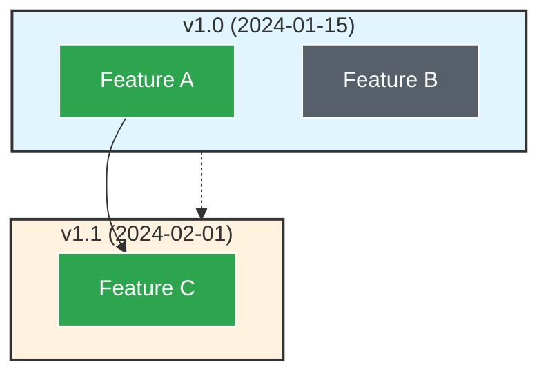

# Action is Roadmap

[](https://github.com/inat-get/action-is-roadmap/releases)
[](https://opensource.org/licenses/MIT)

A GitHub Action that automatically generates visual roadmaps from your GitHub Milestones, Issues, and issue dependencies. Creates interactive Mermaid flowcharts showing project timelines, issue status, and blocking relationships.

## Features

- **Automatic Roadmap Generation** — Creates Mermaid diagrams from your GitHub project data
- **Milestone Visualization** — Groups issues by milestones with color-coded timelines
- **Dependency Mapping** — Visualizes issue blocking relationships (tracked issues / sub-tasks)
- **Flexible Output** — Write to repository file or publish to GitHub Wiki
- **Customizable Styling** — Configure colors and shapes via YAML
- **Issue Filtering** — Exclude specific issues by label
- **Status Indicators** — Open and closed issues shown with distinct colors

## How It Works

The action fetches:
- **Open milestones** (sorted by due date)
- **Issues** from open milestones + open orphan issues (no milestone)
- **Dependencies** via GitHub's tracked issues (sub-task) relationships

Then generates a Mermaid flowchart showing:
- Milestones as subgraphs with due dates
- Issues with configurable shapes (box, round, stadium)
- Blocking arrows (blocker → blocked)
- Chronological flow between milestones

## Usage

### Basic Example

```yaml
name: Generate Roadmap
on:
  schedule:
    - cron: '0 0 * * *'  # Daily
  workflow_dispatch:

jobs:
  roadmap:
    runs-on: ubuntu-latest
    permissions:
      contents: write
    steps:
      - uses: actions/checkout@v4
      
      - name: Generate Roadmap
        uses: inat-get/action-is-roadmap@v1
        with:
          github_token: ${{ secrets.GITHUB_TOKEN }}
          output_type: file
          output_path: ROADMAP.md
```

### Wiki Output

```yaml
      - name: Generate Roadmap
        uses: inat-get/action-is-roadmap@v1
        with:
          github_token: ${{ secrets.GITHUB_TOKEN }}
          output_type: wiki
          wiki_title: Roadmap
```

### With Custom Styling

Create `.github/roadmap-styles.yml`:

```yaml
colors:
  milestones:
    - '#e1f5fe'
    - '#fff3e0'
  issues:
    open: '#2da44e'
    closed: '#57606a'
  arrows:
    blocking: '#000000'
    chronological: '#666666'
shapes:
  issue: box  # box, round, or stadium
```

Then reference it:

```yaml
      - name: Generate Roadmap
        uses: inat-get/action-is-roadmap@v1
        with:
          github_token: ${{ secrets.GITHUB_TOKEN }}
          config_file: .github/roadmap-styles.yml
          exclude_label: skip-roadmap
```

## Inputs

| Input | Description | Required | Default |
|-------|-------------|----------|---------|
| `github_token` | GitHub token for API access | Yes | — |
| `output_type` | Output target: `file` or `wiki` | No | `file` |
| `output_path` | File path for output (when `output_type=file`) | No | `ROADMAP.md` |
| `wiki_title` | Wiki page title (when `output_type=wiki`) | No | `Roadmap` |
| `config_file` | Path to style configuration YAML | No | `.github/roadmap-styles.yml` |
| `exclude_label` | Label to exclude issues from roadmap | No | — |

## Outputs

| Output | Description |
|--------|-------------|
| `diagram` | Generated Mermaid diagram code |

## Setup Requirements

### For File Output
The action commits the roadmap file automatically. Ensure your workflow has:
```yaml
permissions:
  contents: write
```

### For Wiki Output
Enable the wiki in your repository settings. The action clones, updates, and pushes to the wiki repository automatically.

### Issue Dependencies
The action uses GitHub's "tracked issues" (sub-tasks) to determine blocking relationships. To set up dependencies:
1. Open an issue
2. Use the "Track in" feature to mark it as blocked by other issues
3. Or use the GitHub API/CLI to create `trackedIn` relationships

## Example Output



## Development

```bash
npm install
npm run all  # Format, lint, test, and build
```

## License

MIT © Ivan Shikhalev
